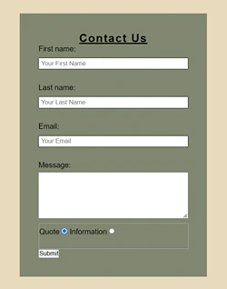

# **M.L. Trees**

## Site Overview

M.L Trees is a site that will be used for customers requiring domestic tree work in the Hertforshire area. The aim is for potential customers to be able to vist the site to request a qoute or information regarding a tree and get a brief understanding of who they will be hiring and the kind of work that can be carried out.

The website is currently ready to go live however in the future i would like to add a customer testimonials section once customer feedback has been collected. 

## Features

[**Header**](https://crimson-wizard.github.io/M-L-Trees/index.html)
- Company Name.
- Image of a beech tree.
- Navigation bar.

[**Navagation Bar**](https://crimson-wizard.github.io/M-L-Trees/index.html)
- Menu bar to help navigate the main page and link to the contact page.
- Easily navigate to any section from all 3 pages.
- Includes: Home, About, Services, Gallery and Contact.

## Main Section 

[**About Section**](https://crimson-wizard.github.io/M-L-Trees/#about)
- Brief paragraph to give the cutomer knowledge about the company. 
- Image of friendly and happy staff to give the customer a level of trust.

[**Services Section**](https://crimson-wizard.github.io/M-L-Trees/#services)
- Break down of types of tree work that can be carried out.
- Image with each service to help customer visualise the work.
- Explanation of the work and bennefits.
- All images kept inline to help flow of page content.

 

[**Gallery Section**](https://crimson-wizard.github.io/M-L-Trees/#gallery)
- Video gallery for customer to view work being carried out.
- Plus a humerous video that gives company personality.
- Videos kept inline to continue flow of the page and content.

**Footer Section**
- A map displaying Hertforshire where company is based.
- Company tree logo.
- Social media links so customers can follow and view on other platforms.

## Contact Page

[**Contact Form**](https://crimson-wizard.github.io/M-L-Trees/form.html)
- Contact form gives the customer the oportunity to contact us with their name, email and a message about the work they would like carried out.
- selectable button to show if its a quote for work or just information regarding a tree.

**Contact Information**
- Contains phone and email number should customer desire to contact directly.

**Working Hours**
- Display opperating hours for customers information.
  

   

