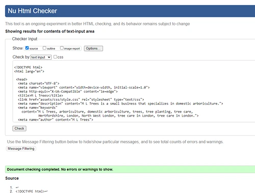

# **M.L. Trees**

## Site Overview

M.L Trees is a site that will be used for customers requiring domestic tree work in the Hertforshire area. The aim is for potential customers to be able to vist the site to request a qoute or information regarding a tree and get a brief understanding of who they will be hiring and the kind of work that can be carried out.

## Features

[**Header**](https://crimson-wizard.github.io/M-L-Trees/index.html)
- Company Name.
- Image of a beech tree.
- Navigation bar.

[**Navagation Bar**](https://crimson-wizard.github.io/M-L-Trees/index.html)
- Menu bar to help navigate the main page and link to the contact page.
- Easily navigate to any section from all 3 pages.
- Includes: Home, About, Services, Gallery and Contact.

## Main Section 

[**About Section**](https://crimson-wizard.github.io/M-L-Trees/#about)
- Brief paragraph to give the cutomer knowledge about the company. 
- Image of friendly and happy staff to give the customer a level of trust.

[**Services Section**](https://crimson-wizard.github.io/M-L-Trees/#services)
- Break down of types of tree work that can be carried out.
- Image with each service to help customer visualise the work.
- Explanation of the work and bennefits.
- All images kept inline to help flow of page content.

   

[**Gallery Section**](https://crimson-wizard.github.io/M-L-Trees/#gallery)
- Video gallery for customer to view work being carried out.
- Plus a humerous video that gives company personality.
- Videos kept inline to continue flow of the page and content.

**Footer Section**
- A map displaying Hertforshire where company is based.
- Company tree logo.
- Social media links so customers can follow and view on other platforms.

## Contact Page

[**Contact Form**](https://crimson-wizard.github.io/M-L-Trees/form.html)
- Contact form gives the customer the oportunity to contact us with their name, email and a message about the work they would like carried out.
- selectable button to show if its a quote for work or just information regarding a tree.

  

**Contact Information**
- Contains phone and email number should customer desire to contact directly.
  

**Working Hours**
- Display opperating hours for customers information.
  

## Contact Reply Page

**Form Reply**
- Once the details of the form have been filled and sent the customer will be taken to a message to acknoledge the submition of the form.
- Button to be taken back to main page of site

**Features left To Implement**
 - Customer testimonials.
   
The webpage in its curent state is fully functional and achives all the goals id like it too. I would like to revist in the future to adsd a testimonials page once i have customer feedback.

## Testing 

The webpage has been tested on both Crome and Microsoft Edge. All links were tested and are working and videos tested and work correctly. I then went on to run the deployed source code through HTML and CSS validators, the resposne can be seen below. 

### **Validator Testing**

**Main Page HTML Validation.**

**Form HTML Validation.**

**Form Reply HTML Validation.**

**Css Validation**
- w3c css validation service using jigsaw validator.
  

  
### **Bugs & how they where fixed**

**Form Reply Bug**

- Error in form-reply, button cannot be contained in hyperlink
- To fix this i went into the html code and change code to a form with a button contained within:

**Lighthouse**
I have also run each page though lighthouse on both mobile and desktop.

*Main Page.*
Desktop

Mobile

*Form.*
Desktop

Mobile

*Form Reply.*
Desktop

Mobile

## Deployment 
The site was deployed using github. THe steps i took to achive this are as follows:
- In the left hand menu i selected pages.
- selected main branch from drop down menu and clicked save.
- Github then displayed a message saying the deployment was successful.

You can vist the live page here: [M.L. Trees live webpage](https://crimson-wizard.github.io/M-L-Trees/)
 

## Credits

**Content**
- The icons in the footer were taken from font awesome.
- Map section is from google maps.
- The submit and return to main page button code was used from https://www.cssbuttongenerator.com/
- This site was made using Replit code editor

**Media**
- All photos used in about and services were taken by and owned by m.l trees.
- All videos in the gallery section were taken by and owned by m.l trees.
- Header image is from https://www.pexels.com